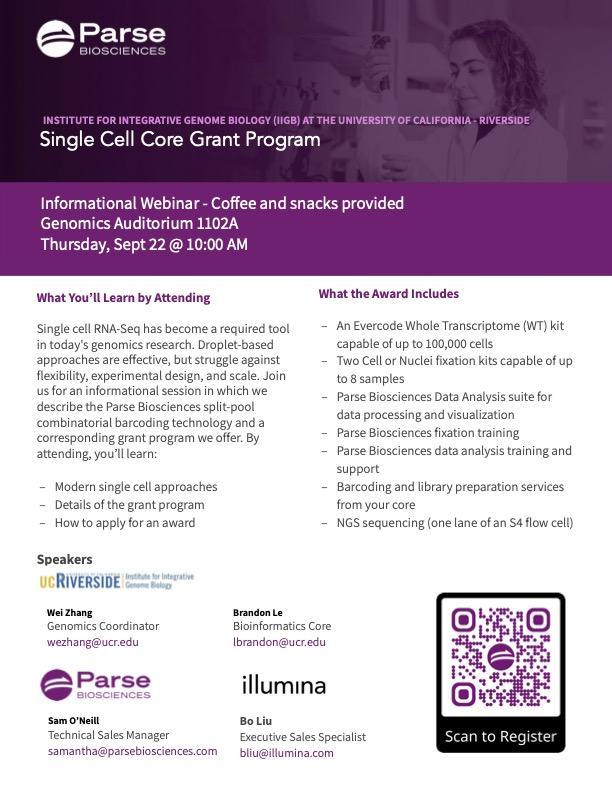

### Info
An informational hybrid in-person/webinar on a single cell core grant program
hosted by the IIGB Genomics and Bioinformatics Cores, Parse Biosciences, and Illumina.

The session provides information on the split-pool combinatorial barcoding technology
developed at Parse Biosciences and a grant program involving the IIGB cores, Parse Biosciences,
and Illumina. Here short talks by:
- **Wei Zhang** (Genomics Coordinator)
- **Brandon Le** (Bioinformatics Coordinator)
- **Bo Liu** (Executive Sales Specialist, Illumina)
- **John Walsh** (VP Marketing, Parse Biosciences)
- **Samantha O'Neill** (Technical Sales Manager, Parse Biosciences)  

Come learn more about how to apply for the award.

### Resource
You can watch a recording of the session at this link: [video](http://resources.parsebiosciences.com/core-grant-program-ucr-iigb) 

### Flyer

